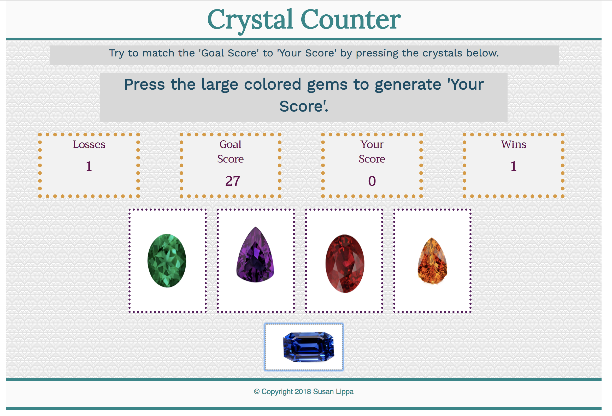

# Crystal_Counter
Title: Crystal Counter \
Developer: Susan Lippa \
Deployment Date:  Jan 31, 2018 \
For:  Northwestern Coding Bootcamp \
Published: GitHub <https://slippa91.github.io/Crystal_Counter/> \
Built with: HTML5, CSS3, Boostrap3, Javascript & jQuery

#Summary: 

Five randomly generated values are assigned to the 'Goal Score' and each of the four crystals.

Attempt to TIE the 'Goal Score' with 'Your Score' by clicking on some combination of the four crystals.

Clicking on the blue crystal at the bottom will reset your game. The board will keep track of your wins and losses. 

#Development:

Crystal Counter is, admittedly, not a very sophisticated program but, I completed the project in week 3 of Bootcamp. At that point, it was amazing to think that I could create ANYTHING let alone a game that pretty much did what I intended.  

I am most proud of that fact that, for that point in our course-work,  it is a pretty dry codebase. 

Although I intend to rework almost all of my projects from Bootcamp, I think I will leave this one alone. Or maybe save it for last.

